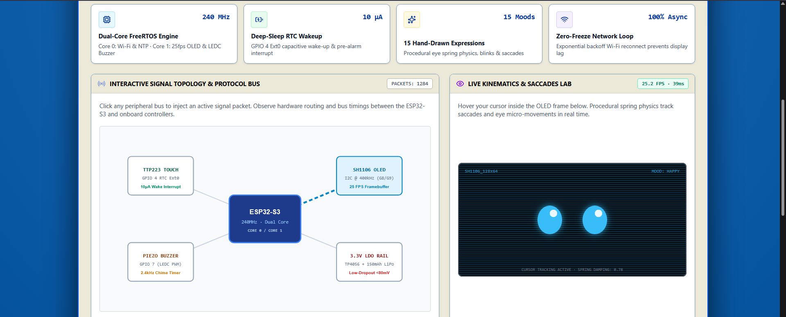
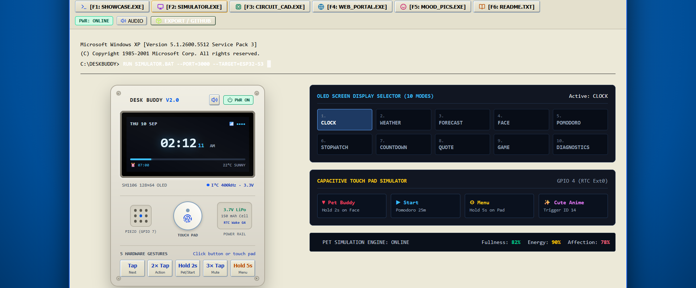
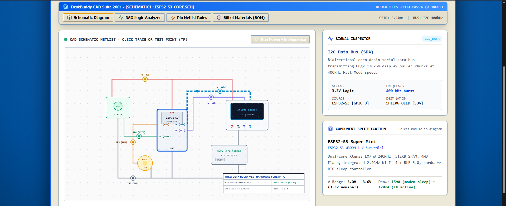
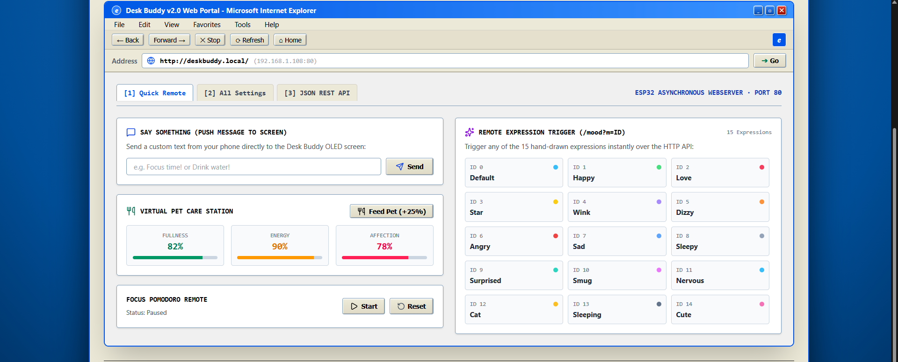

<div align="center">

# `desk-buddy-showcase`

**An interactive ESP32-S3 desktop companion, presented as a web workbench.**

<p>
  <a href="https://deskbuddyshowcase.netlify.app/"></a>
  <a href="https://github.com/obsfusc8/desk-buddy-showcase/blob/main/LICENSE"></a>
  
  
  
  
</p>

</div>

```console
$ desk-buddy --mode showcase
> booting simulator...
> OLED ........ online
> touch ....... ready
> signal bus .. 400 kHz
```

Desk Buddy is an interactive showcase for an ESP32-S3 desktop companion. The
project combines a React and TypeScript web workbench with companion firmware
for an OLED display, capacitive touch input, a piezo buzzer, and battery
monitoring.

## Sneak peek

The live showcase is available at
[deskbuddyshowcase.netlify.app](https://deskbuddyshowcase.netlify.app/).
It opens with the Desk Buddy v2.0 showcase and presents the project as an
interactive Windows XP-inspired workbench.

<div align="center">
  
</div>

<div align="center">
  
</div>

<div align="center">
  
</div>

<div align="center">
  
</div>

The main experiences are:

- A live device simulator with a 128x64 OLED view, touch gestures, moods,
  games, timers, and synthesized feedback.
- A circuit workbench with an interactive schematic, signal traces,
  oscilloscope view, pin map, and bill of materials.
- A web dashboard for remote controls, device settings, pet stats, and API
  payload examples.
- An expression gallery, portfolio overview, and owner documentation.

## Setup

### Web workbench

Requirements: Node.js 20 or newer and npm.

```bash
git clone https://github.com/obsfusc8/desk-buddy-showcase.git
cd desk-buddy-showcase
npm install
npm run dev
```

Open `http://localhost:3000`. To create a production build, run:

```bash
npm run build
```

To run the TypeScript validation used by the project:

```bash
npm run lint
```

The optional `.env.example` documents the environment variables used by
integrations. Do not commit a real `.env` file or API credentials.

### ESP32-S3 firmware

1. Open `firmware/DeskBuddy_ESP32S3_v2.0.ino` in Arduino IDE 2.2 or newer.
2. Install the `U8g2` and `ArduinoJson` libraries from the Arduino Library
   Manager.
3. Select `ESP32S3 Dev Module`, enable USB CDC on boot, use the 4 MB flash
   setting, and set the upload speed to 921600.
4. Connect the board over USB-C and upload the sketch.

The firmware expects an SH1106 I2C OLED, a TTP223 touch sensor, a passive
piezo buzzer, and the battery voltage divider described by the pin map in the
web workbench.

## Repository layout

```text
firmware/             ESP32-S3 Arduino sketch
src/components/       Simulator, dashboard, workbench, and documentation UI
src/data/              Circuit and expression data
src/services/          Browser-side sound effects
public/                Static assets
index.html             Vite entry document
vite.config.ts         Vite configuration
```

## License

This project is distributed under the MIT License. See `LICENSE`.
